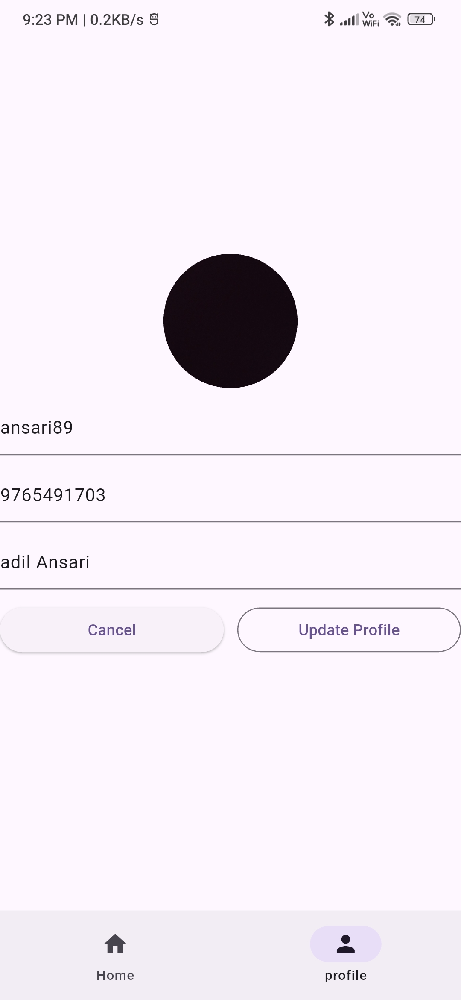

# assingment

## Feature copleted
1. Authentication Module
2. Product Listing Page
3. Profile Page (CRUD Operations)
4. Product Description Page
5. Product Share Functionality

## setup installation
> Set up is easy just clone the repository or donload as .zip and open in Android Studion and run wihch divice you want.

## APi end point
`https://dummyjson.com/products`

`https://dummyjson.com/products/category`

## Screeenshots

